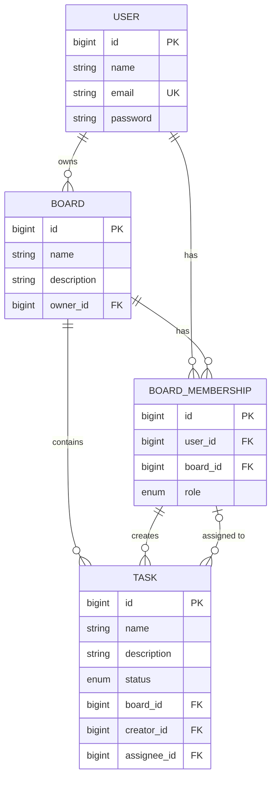

# Task Manager API (Trello-lite)

A backend REST API for a lightweight project/task management tool — think Trello, simplified. Built as a portfolio project to practice a full Spring Boot backend stack: JPA/Hibernate, layered architecture, JWT authentication, and role-based authorization.

Users can create boards, invite members with roles (**ADMIN** / **MEMBER**), create tasks, assign them to board members, and track progress through statuses.

## Tech Stack

- **Java 17**
- **Spring Boot** (Web, Data JPA, Security)
- **Hibernate / JPA** — ORM, schema auto-generated from entities
- **MySQL** — relational database
- **Spring Security + JWT** (`jjwt`) — stateless authentication
- **Lombok** — boilerplate reduction in DTOs
- **JUnit 5 + Mockito** — unit testing with mocked dependencies
- **Maven** — build tool

## Core Domain Model



**Key design decisions:**
- A user's role (`ADMIN`/`MEMBER`) is scoped **per board**, not global — modeled via the `BoardMembership` join entity rather than a role field on `User`.
- `Task.creator` and `Task.assignee` reference `BoardMembership` (not `User` directly), guaranteeing at the data-model level that both are actual members of the task's board.
- Passwords are hashed with BCrypt; only hashes are ever persisted, and plain/hashed passwords never appear in API responses or error messages.

## Authentication & Authorization

- Stateless authentication via **JWT** (`Authorization: Bearer <token>`), issued on login.
- A custom `OncePerRequestFilter` validates the token on every request and populates Spring Security's `SecurityContext`.
- The currently authenticated user is resolved via `@AuthenticationPrincipal` in controllers — client-supplied user IDs are never trusted for identity.
- Authorization is enforced in the service layer based on board membership:
  - Only board **ADMIN**s can invite new members or assign tasks to a member.
  - A task's status can be changed by the board **ADMIN** or the task's **assignee**.
  - Login errors are intentionally generic ("Invalid credentials") for both "user not found" and "wrong password" to avoid user-enumeration attacks.

## API Endpoints

| Method | Endpoint | Auth required | Description |
|---|---|---|---|
| POST | `/api/users/register` | No | Register a new user |
| POST | `/api/auth/login` | No | Log in, returns a JWT |
| GET | `/api/users/{id}` | Yes | Get user by id |
| POST | `/api/boards` | Yes | Create a board (creator becomes ADMIN automatically) |
| GET | `/api/boards/{id}` | Yes | Get board by id |
| POST | `/api/boards/{id}/invite` | Yes (ADMIN) | Invite a user to the board with a role |
| POST | `/api/tasks` | Yes | Create a task on a board |
| PUT | `/api/tasks/{taskId}/assign?assigneeId=` | Yes (ADMIN) | Assign a task to a board member |
| PUT | `/api/tasks/{taskId}/status?status=` | Yes (ADMIN or assignee) | Change task status |
| GET | `/api/tasks?boardId=&status=` | Yes | List tasks for a board, optionally filtered by status |

Error responses follow a consistent JSON shape:
```json
{
  "status": 403,
  "error": "Forbidden",
  "message": "Anya is not an admin of the board"
}
```

## Running Locally

**Prerequisites:** Java 17+, Maven, a running MySQL instance.

1. Clone the repository:
   ```bash
   git clone https://github.com/<your-username>/task-manager.git
   cd task-manager
   ```

2. Create a database:
   ```sql
   CREATE DATABASE task_manager;
   ```

3. Configure `src/main/resources/application.properties`:
   ```properties
   spring.datasource.url=jdbc:mysql://localhost:3306/task_manager
   spring.datasource.username=root
   spring.datasource.password=your_password
   spring.jpa.hibernate.ddl-auto=update
   spring.jpa.show-sql=true
   ```

4. Run the application:
   ```bash
   mvn spring-boot:run
   ```

   The API will be available at `http://localhost:8080`.

## Example Flow (via curl / Postman)

```bash
# 1. Register
curl -X POST http://localhost:8080/api/users/register \
  -H "Content-Type: application/json" \
  -d '{"name":"Anya","email":"anya@example.com","password":"qwerty123"}'

# 2. Log in
curl -X POST http://localhost:8080/api/auth/login \
  -H "Content-Type: application/json" \
  -d '{"email":"anya@example.com","password":"qwerty123"}'
# -> { "token": "eyJhbGciOiJIUzI1NiJ9..." }

# 3. Create a board (use the token from step 2)
curl -X POST http://localhost:8080/api/boards \
  -H "Content-Type: application/json" \
  -H "Authorization: Bearer <token>" \
  -d '{"name":"Website Redesign","description":"Q3 project"}'
```

## Testing

Unit tests (JUnit 5 + Mockito) cover the service layer's business rules and authorization logic — e.g. registration validation, password hashing, board-membership checks, and task status/assignment permission rules.

```bash
mvn test
```

## Possible Next Steps

- Request validation (`@Valid` / Bean Validation) on DTOs
- Pagination for task/board listings
- OpenAPI/Swagger documentation
- Integration tests via `MockMvc` covering full request → response flows

## Project Structure

```
src/main/java/org/kamal/taskmanager/
├── controllers/    # REST controllers
├── services/       # Business logic, authorization checks
├── repository/     # Spring Data JPA repositories
├── models/         # JPA entities + enums
├── dto/
│   ├── request/    # Incoming request bodies
│   └── response/   # Outgoing response bodies (never expose password hashes)
├── security/       # JWT service, auth filter, UserDetails implementation
├── exceptions/     # Custom exceptions + global exception handler
└── config/         # Security configuration, bean definitions
```
